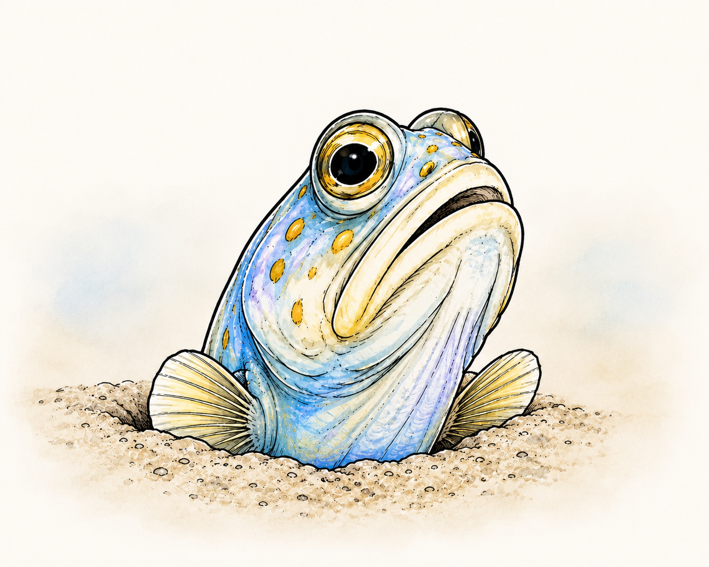

<div align="center">
  <picture>
    
  </picture>

  <p>
    A minimal CLI for syncing and scoping AI agent skills, agents, and prompts
    across tools, devices, and projects.
  </p>
</div>

## What Is Jawfish?

Jawfish is a small package manager for reusable agentics:

1. Keep skills, prompts, and agents in one content library.
2. Install them globally or into a project.
3. Update them when upstream changes.

## Quick Start

Install:

```sh
bun install --global github:devdogfish/agentics-cli
```

Configure:

```json
{
  "allowedTools": ["codex"],
  "defaultTool": "codex",
  "contentLibrary": "git@github.com:you/agentics.git"
}
```

Save it at `~/.jawfish/config.json`.

Add a skill:

```sh
jawfish add handoff
```

Install everything from the manifest:

```sh
jawfish install
```

Update later:

```sh
jawfish update
```

## How It Works

Jawfish reads from one content library and writes tool-native files into the
current project or your global tool config.

Project installs are tracked in `jawfish.json`. Global installs are tracked in
`~/.jawfish/jawfish.json`.

## Commands

| Command | What it does |
| --- | --- |
| `jawfish add <name>` | Install from your library |
| `jawfish add <source>` | Import from a URL or local file |
| `jawfish install` | Reinstall everything in the manifest |
| `jawfish update [name]` | Pull upstream changes |
| `jawfish remove <name>` | Remove a managed install |

Add `--global` to target your global tool config instead of the current
project.

Jawfish currently supports `codex`, `claude-code`, and `hermes`.

Project installs go into `.codex/`, `.claude/`, or `.hermes/`. Global Codex
installs go into:

```sh
~/.codex/skills
~/.codex/agents
~/.codex/prompts
```

## Develop

```sh
bun install
bun run typecheck
bun run test
```
