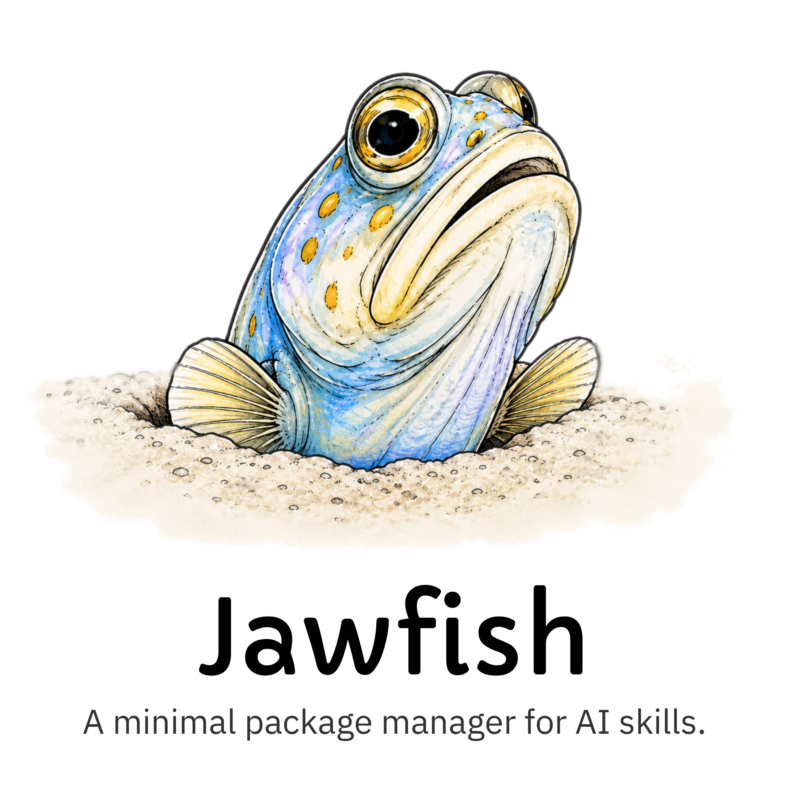

<div align="center">
  <picture>
    <source media="(prefers-color-scheme: dark)" srcset="./assets/jawfish-logo-dark.png">
    <source media="(prefers-color-scheme: light)" srcset="./assets/jawfish-logo-light.png">
    
  </picture>
</div>

## What Is Jawfish?

Jawfish is a small package manager for reusable agentics:

1. Keep skills, prompts, and agents in one git repo on disk.
2. Install them globally or into a project.
3. Update them when upstream changes.

## Quick Start

Install:

```sh
bun install --global jawfish
```

Initialize with the interactive setup:

```sh
jawfish init
```

Interactive setup creates machine config, creates or links the agentics repo,
offers global starter installs, can import existing global provider skills, and
then sets up the current project.

Use `-y` for noninteractive defaults:

```sh
jawfish init -y
```

Add a skill from a URL or local path:

```sh
jawfish add https://github.com/mattpocock/skills/blob/main/skills/productivity/handoff/SKILL.md
```

Browse repo entries:

```sh
jawfish list
```

Install everything from the manifest:

```sh
jawfish install
```

Update later:

```sh
jawfish update
```

## How It Works

Jawfish reads packages from the git repo configured by `agenticsRepo`
(default: `~/.jawfish/agentics`) and writes tool-native files into the
current project or your global tool config.

Imported files are copied into that repo, then copied into each installed
project/global tool directory. Jawfish does not symlink: tools get normal native
files, and each install can be managed independently. `jawfish update`
re-fetches upstream sources into the repo, commits/pushes when possible, and
reinstalls managed files where already installed.

Project installs are tracked in `jawfish.json`. Global installs are tracked in
`~/.jawfish/jawfish.json`.

## Commands

| Command                            | What it does                         |
| ---------------------------------- | ------------------------------------ |
| `jawfish add <name>`               | Install from your repo               |
| `jawfish add <source>`             | Import from a URL or local file      |
| `jawfish init [options]`           | Create or edit setup                 |
| `jawfish import-skills <provider>` | Import global provider skills        |
| `jawfish install <name>`           | Same as `jawfish add <name>`         |
| `jawfish i <name>`                 | Same as `jawfish add <name>`         |
| `jawfish install`                  | Reinstall everything in the manifest |
| `jawfish i`                        | Same as `jawfish install`            |
| `jawfish list`                     | Browse available repo entries        |
| `jawfish update [name]`            | Pull upstream changes                |
| `jawfish upgrade`                  | Upgrade jawfish itself               |
| `jawfish remove <name>`            | Remove a managed install             |
| `jawfish --version`                | Print jawfish version                |
| `jawfish -v`                       | Same as `jawfish --version`          |

`import-skills` previews found skills and conflicts, then asks before writing.
Add `-y` or `--yes` to import without the prompt.

`list` shows project/global install status. It accepts
`--type skill|agent|prompt`, `--installed project|global|both|none|any`,
and `--raw` for JSON output.

Jawfish pulls remote-backed repos before install/list and commits/pushes repo
changes after add/import/update when an upstream exists.

`init` runs an interactive first-run machine setup when config is missing. It
asks for the default tool, creates the local agentics repo by default or links
an existing local path/git URL, inspects what Jawfish can see, writes repo ignore
rules, creates the global manifest, offers registered repo entries as global
starter installs, and can import existing global provider skills. If machine
setup already exists, it offers project setup or machine reinitialize. The
reinitialize menu shows the current config and can change the default tool,
change the agentics repo link, install global starter entries, or import
existing global provider skills. If the linked repo is empty, import is offered
before starter selection so imported skills can be installed in the same run. It
does not create GitHub repositories, wipe repo contents, or ask branch questions.

`init -y` or `init --yes` uses noninteractive defaults. With no machine config,
it creates `~/.jawfish/config.json`, the configured/default agentics repo, repo
ignore rules, and an empty global manifest. With machine config already present,
it creates the project `jawfish.json` if missing.

## Configuration

Add `--global` or `-g` to target your global tool config instead of the
current project.

Jawfish currently supports `codex`, `claude-code`, `hermes`, `openclaw`,
`opencode`, and `pi`.

`defaultTool` must be one of those supported tools. You can also set it with
`JAWFISH_DEFAULT_TOOL`.

`agenticsRepo` points to the package repo. If unset, Jawfish uses
`~/.jawfish/agentics`. You can also set it with
`JAWFISH_AGENTICS_REPO`.

Project installs go into `.codex/`, `.claude/`, `.hermes/`, `skills/`,
`.opencode/`, or `.pi/`.

Global installs go into:

| Tool          | Global root            |
| ------------- | ---------------------- |
| `codex`       | `~/.codex`             |
| `claude-code` | `~/.claude`            |
| `hermes`      | `~/.hermes`            |
| `openclaw`    | `~/.openclaw`          |
| `opencode`    | `~/.config/opencode`   |
| `pi`          | `~/.pi/agent`          |

## Develop

```sh
bun install
bun run typecheck
bun run test
```
